# Windows: Graphene Node GUI

Graphene runs on 64-bit Windows 10 and 11 as two programs:

* **Graphene Node** (`graphene-node-gui.exe`): a tray app with a dashboard. It starts the node, shows how it syncs,
  stops it cleanly and restarts it after a crash. This is what most people run.
* **witness_node** (`witness_node.exe`): the node itself, the same program as on Linux. Graphene Node runs it for
  you; it also runs on its own from `cmd` or PowerShell.

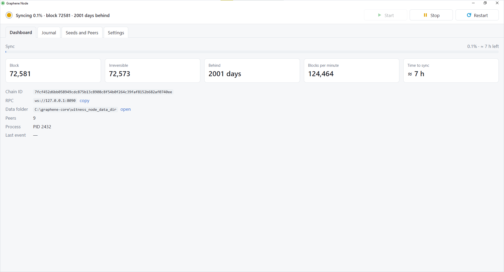

## Getting it

Download `graphene-node-win64-<version>.zip` from the
[latest release](https://github.com/carbon-witness/graphene-core/releases/latest) and unpack it into a folder of its
own, for example `C:\Graphene`. The zip holds:

| File | What it is |
|---|---|
| `graphene-node-gui.exe` | Graphene Node, the app you start |
| `witness_node.exe` | the node |
| `WebView2Loader.dll` | draws the app's window; keep it next to `graphene-node-gui.exe` |
| `LICENSE.txt` | the MIT license |

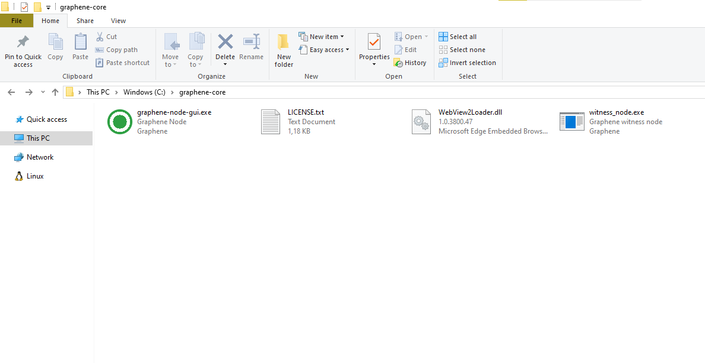

Nothing is installed: the three programs stay in this folder, and the node keeps its blockchain in
`witness_node_data_dir` next to them. Pick a disk with room to spare; the blockchain takes several gigabytes and grows.

The window uses Microsoft Edge WebView2, which comes with Windows 10 and 11.

## First start

Start `graphene-node-gui.exe`.

**Security warning.** The programs are not signed, and Windows marks files downloaded from the internet, so the first
start may bring up a warning. With SmartScreen on, it is "Windows protected your PC": click **More info**, then
**Run anyway**.

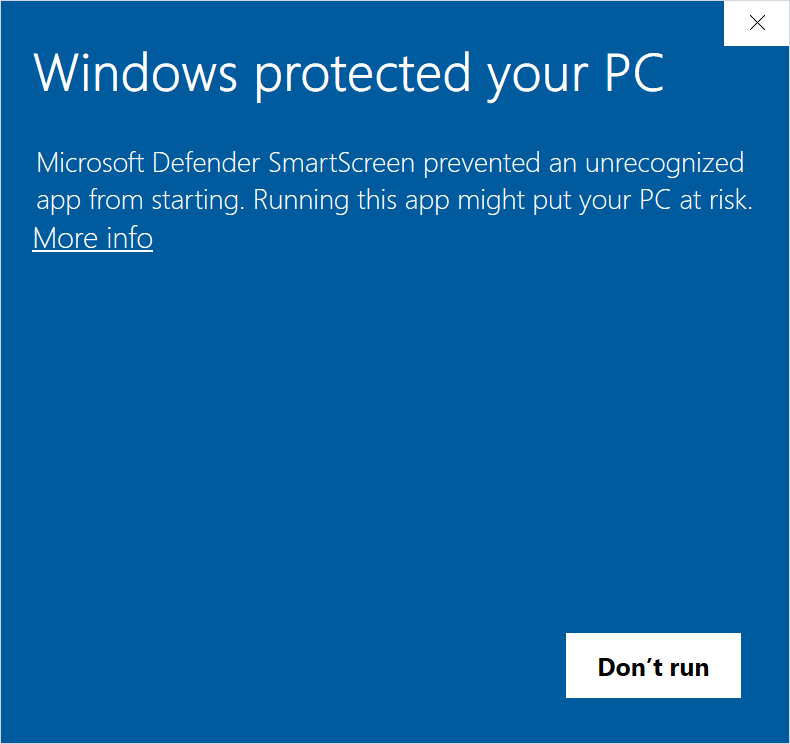
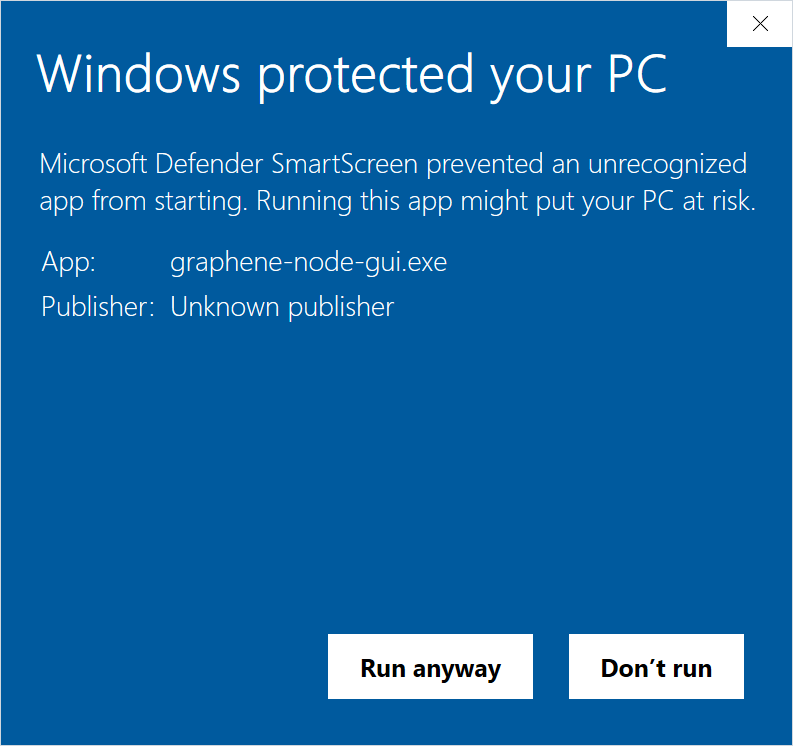

Otherwise it is "Open File - Security Warning" with "Unknown Publisher": click **Run**, after
clearing "Always ask before opening this file" if you do not want to see it again.

**Firewall.** The node listens for other nodes, so Windows may ask whether to allow it on the network. Allow it on
private networks. Outgoing connections, which the node needs to sync, work either way.

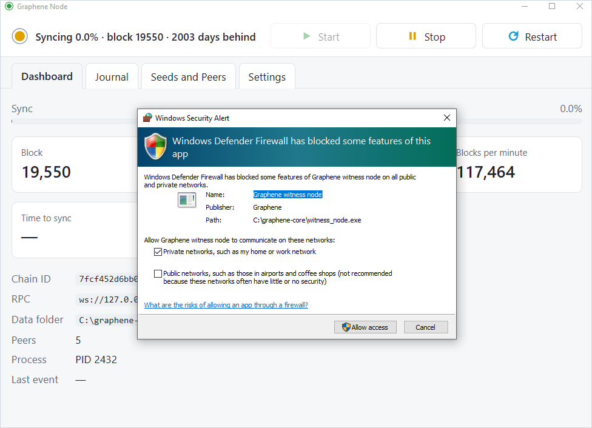

The app starts the node at once. The node creates `witness_node_data_dir` with a default `config.ini`, connects to the
seed nodes and downloads the chain from the first block. The dashboard shows the progress and the estimated time left;
a full sync takes several hours, depending on the computer and the network.

The tray icon shows the node's state at a glance:

| Icon | State |
|---|---|
|  Yellow dot | starting or syncing |
|  Green play | running and in sync |
|  Blue-cyan arrow | restarting |
|  Pause | stopped |
|  Red cross | failed, see the dashboard |

## The window

### Dashboard

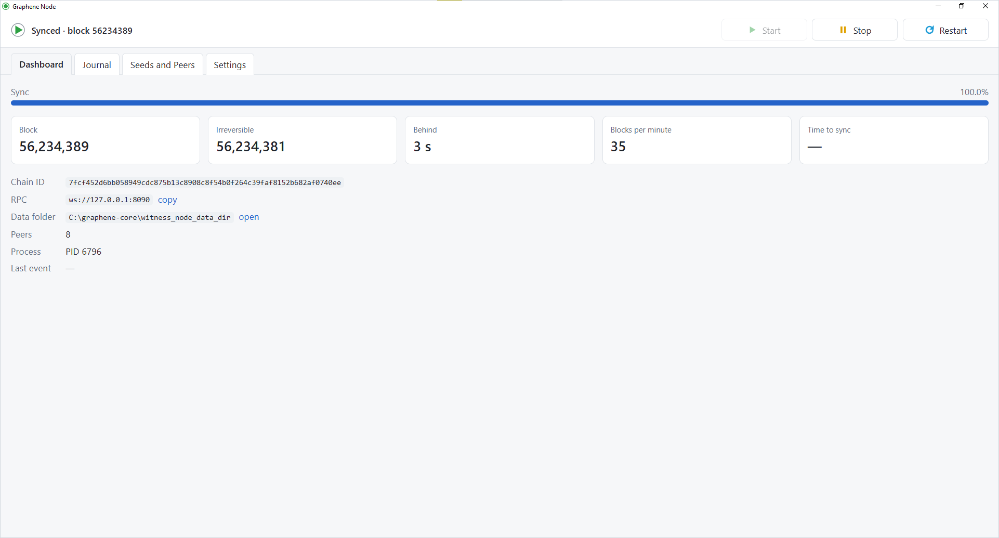

* **Sync**: how far the node has come, by time, with the estimated time left while it catches up.
* **Block** and **Irreversible**: the node's head block and the last block that can no longer change.
* **Behind**: how old the head block is. A node in sync is a few seconds behind.
* **Blocks per minute**: the sync speed. A node in sync gets the blocks as the network makes them, a few dozen a minute.
* **Time to sync**: when the node will catch up at its current speed; a dash once it is in sync.
* **RPC**: the node's API address, for wallets and tools on this computer. **copy** puts it on the clipboard.
* **Data folder**: where the blockchain, `config.ini` and the logs are. **open** shows it in Explorer.
* **Peers**: how many nodes the node is connected to.

### Journal

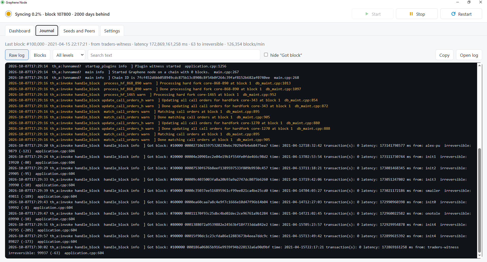

The node's log as it is written, coloured by level like a Linux console: warnings in yellow, errors in cyan. The level
filter and the search narrow it down; **Blocks** shows the received blocks as a table. **Open log** opens the log file
itself.

### Seeds and Peers

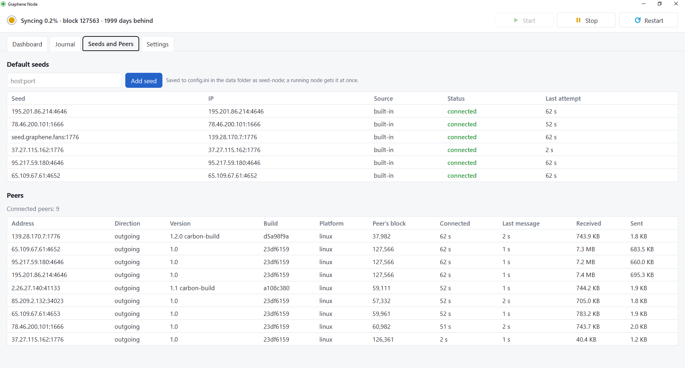

**Default seeds** are the nodes the node asks first for the addresses of other nodes: the built-in list, and the ones
in `config.ini`. Each shows its status: *connected*, *was connected*, *connection failed*, *rejected us*, *handshake
failed* or *not tried yet*. Hover over a failed status to see why.

**Add seed** adds a node by `host:port`. It is written to `config.ini` in the data folder as `seed-node = host:port`
and passed to the running node at once. Seeds added this way have a **remove** link.

**Peers** are the nodes the node is connected to now, with their release and build. The node keeps up to 20
connections; how many it gets depends on how many nodes are reachable.

### Settings

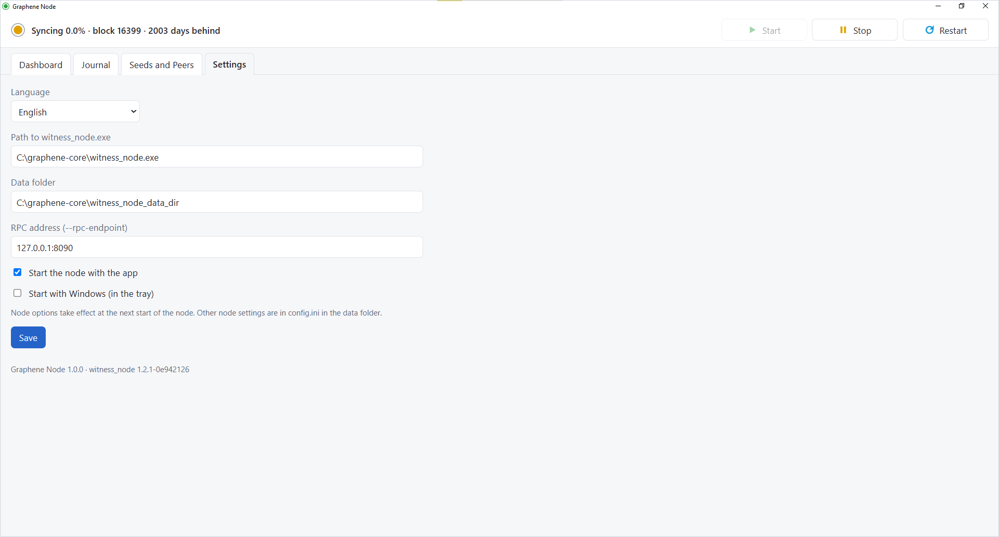

* **Path to witness_node.exe** and **Data folder**: next to the app by default. The defaults follow the app, so the
  whole folder can be moved or copied; clearing a field brings its default back.
* **RPC address**: `127.0.0.1:8090` by default, reachable only from this computer. Any other address opens the node's
  API to the network.
* **Start the node with the app** and **Start with Windows**: with both on, the node runs whenever you are logged in;
  the app then starts in the tray, without its window.
* **Language**: English or Russian.

At the bottom: the app's version and the node's build, which is also on the "Details" tab of each file's properties.

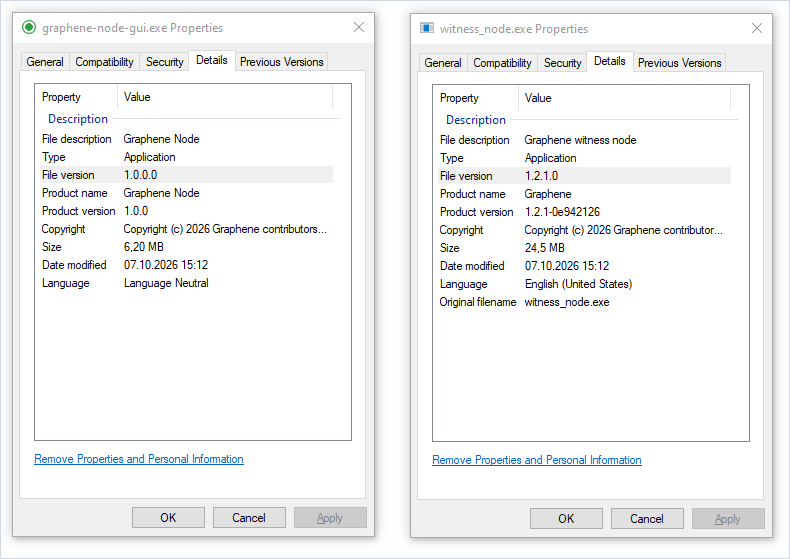

Node options not in this page, such as a witness key or the P2P port, are in `config.ini` in the data folder. They take
effect at the next start of the node: **Restart**.

## Closing and stopping

Closing the window asks whether to stop the node and quit, or to keep the node running in the background with the app
in the tray.

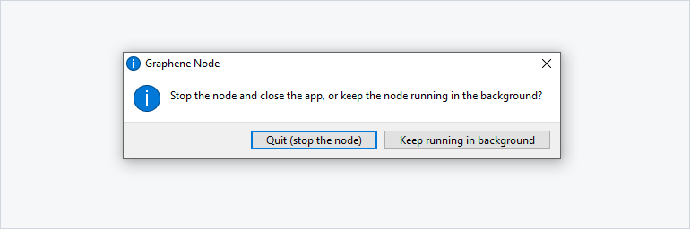

The tray icon's menu (right click) shows the node's state and does the same without the window: opens the dashboard,
starts, stops and restarts the node, copies the RPC address, opens the data folder or the log, and quits.

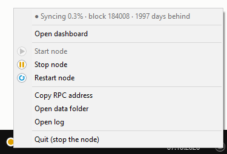

The node always stops cleanly: it saves its database first, which takes a few seconds, so the next start continues
where it stopped instead of replaying the chain. This holds for every way it is stopped:

* **Stop**, **Restart** and **Quit (stop the node)** in the app;
* a Windows shutdown, restart or logoff while the app runs: the app stops the node before Windows ends it;
* Ctrl+C or closing the console window, when the node runs on its own.

If the app crashes or is closed with the node left running, the node goes on. The next start of the app finds it
again.

## Connecting RuDEX to your node

A wallet or exchange app for Graphene can use your own node instead of a public one: it then talks to the network
through your computer, with the low latency of a local connection. In the RuDEX app:

1. Wait until the node is in sync (green icon): a node that is still catching up shows old balances and orders.
2. Open **Settings**, then **Nodes**, then the **Personal** tab, and click **Add node**.
3. Give it any name and enter the address from the dashboard's **RPC** line (**copy** puts it on the clipboard):
   `ws://127.0.0.1:8090`. Click **Confirm**.

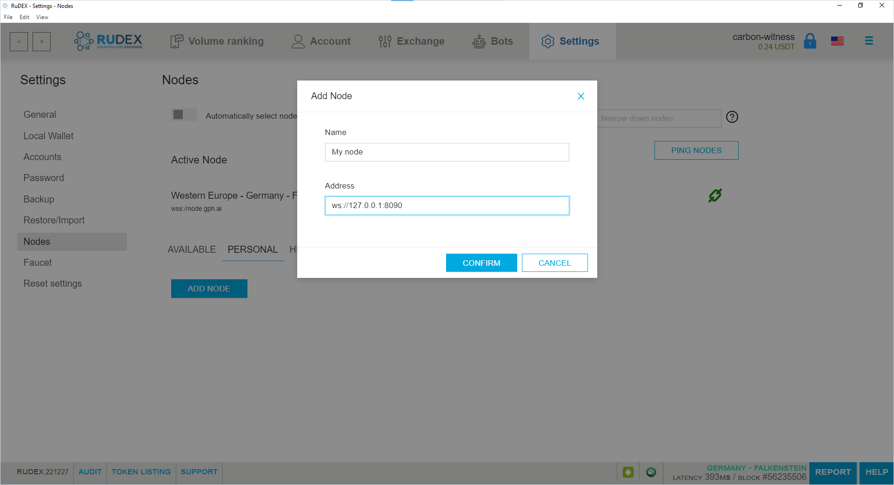

Your node becomes the **Active Node**, with a latency of a few milliseconds; the bar at the bottom shows its name
and its block. Leave **Automatically select node** off, or the app may switch to a public node.

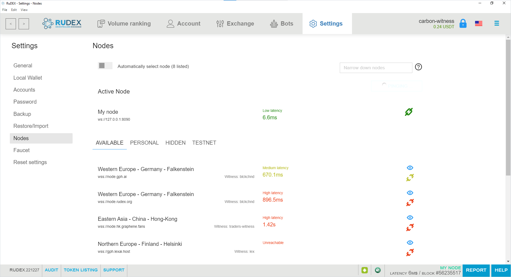

The app needs the node running: when you stop it, choose another node in the list or turn **Automatically select
node** on.

## Updating

1. **Quit (stop the node)** from the tray.
2. Replace `graphene-node-gui.exe`, `witness_node.exe` and `WebView2Loader.dll` with the ones from the new zip. Keep
   `witness_node_data_dir`.
3. Start `graphene-node-gui.exe`.

The app's settings live in `%APPDATA%\org.graphene.node-gui` and stay as they are.

## Running witness_node.exe on its own

`witness_node.exe` is a console program and takes the same options as the node on Linux:

    witness_node.exe --data-dir C:\Graphene\witness_node_data_dir --rpc-endpoint 127.0.0.1:8090

`witness_node.exe --version` prints the release and build. Ctrl+C stops it cleanly.

Only one node can use a data folder at a time. A second one, started by hand next to the app or as another copy,
refuses with "Another witness_node (PID …) is already using the data directory" and exits with code 3.

## When something is wrong

| What you see | What to do |
|---|---|
| "No blocks from the network", no peers | The node cannot reach other nodes. Check the firewall and antivirus: they must let `witness_node.exe` make outgoing connections. On a corporate network, ask the administrator; some networks cut connections to nodes abroad. Add a reachable node with **Add seed**. |
| Seeds stay at *handshake failed* | The connection opens but is cut afterwards, usually by traffic inspection in an antivirus or a corporate gateway. Allow `witness_node.exe` there, or add seeds that are reachable. |
| "Data folder in use by another node" | Another `witness_node.exe` uses the same folder. Stop it, or point the app at another data folder. |
| "The node's API has not answered" on Seeds and Peers | The node is busy applying blocks while it syncs. It goes away once the node is in sync. |
| The node keeps failing | The Journal and **Last event** on the dashboard show why. |

To report a problem, attach:

* `logs\default\default.log` and `logs\p2p\p2p.log` from the data folder;
* `%APPDATA%\org.graphene.node-gui\gui.log`, which records Windows shutdowns.

## Files and folders

| Path | What it holds |
|---|---|
| `witness_node_data_dir\` | the blockchain, `config.ini`, `logs\` |
| `witness_node_data_dir\config.ini` | the node's options, including added seeds |
| `witness_node_data_dir\witness_node.lock` | held by the running node; do not delete |
| `witness_node_data_dir\graphene-node-gui.lock` | the node the app started: its PID, RPC address and the app's API password; with them a restarted app finds the running node again |
| `witness_node_data_dir\graphene-node-gui-api.json` | the app's access to the node's API, for the seed and peer lists |
| `%APPDATA%\org.graphene.node-gui\settings.json` | the app's settings |
| `%APPDATA%\org.graphene.node-gui\gui.log` | what the app did at Windows shutdowns |
| `HKCU\Software\Microsoft\Windows\CurrentVersion\Run`, `Graphene Node` | "Start with Windows", when it is on |

## Building

Both programs are cross-built on Linux: `witness_node.exe` with MinGW-w64, see
[contrib/win64/README.md](contrib/win64/README.md); Graphene Node with Rust and Tauri, see
[gui/README.md](gui/README.md). The `windows` workflow builds both and packages the zip on every push.
